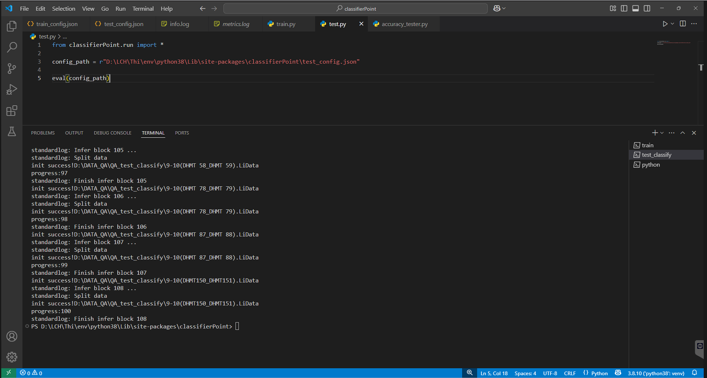
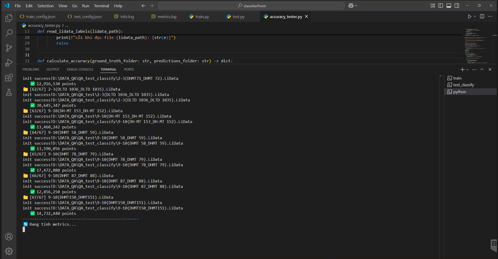

# Point Classification using Deep Learning

## Overview
This project implements a deep learning model for point classification using .Lidata files.

## Project Structure
- `train.py` - Training script for the model
- `test.py` - Classification script using trained model
- `accuracy_tester.py` - Script for evaluating model performance
- `testConfig.json` - Configuration file for testing

## Features
- Incremental training support (continues from existing checkpoints if available)
- Direct classification output to .Lidata files
- Comprehensive metrics evaluation (accuracy, recall, F1-score, precision)

## Usage

### 1. Training

```bash
python train.py
```
- Processes .Lidata files from the configured input folder
- Automatically resumes from existing checkpoints if available
- Creates new model if no checkpoints found

### 2. Classification

**Important**: Backup your original .Lidata files before running classification
```bash
python test.py
```
- Loads configuration from `testConfig.json`
- Writes classification results directly to .Lidata files

### 3. Performance Evaluation

```bash
python accuracy_tester.py
```
- Compares original and classified .Lidata files
- Calculates performance metrics:
  - Accuracy
  - Recall
  - F1-score
  - Precision

## Notes
- Always backup original .Lidata files before classification as the process modifies files directly
- Keep original classified files for accuracy evaluation